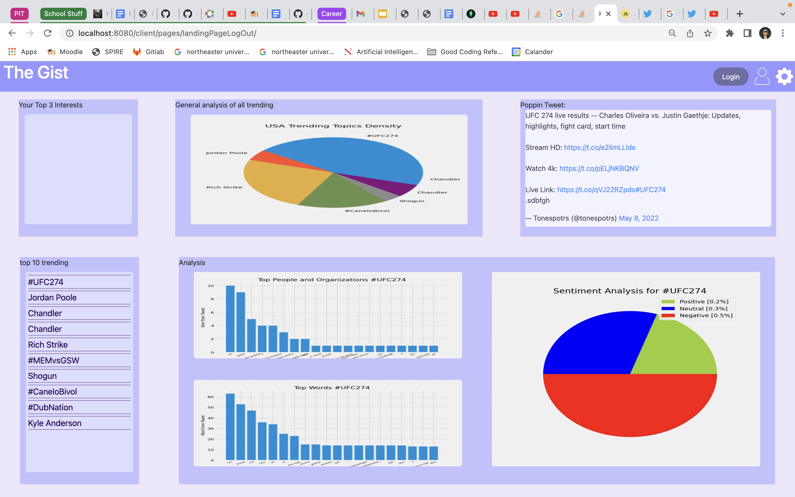
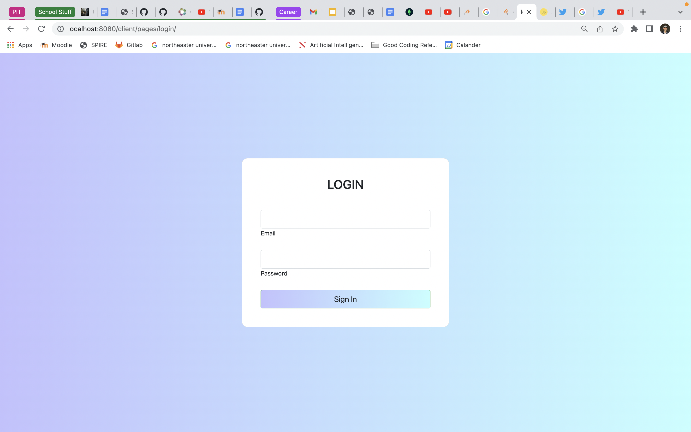

# Title - Group 25: Alright, Alright, Alright

# Application name: The Gist

# Semester - Spring 2022

# Overview

    This website acts as a birds eye view of what is currently going on on twitter. With an in-depth analysis of the top 10 trending topics, and 3 user specefic interests. This is an innovative application as it gives unique experience to everyday users, as well as researchers who hope to get a thorough understanding of what is currently happending on social media. Our target users are anyone who is interested in learning more about the internet and its trends.

# Team Members

    Ezra Savitz - esavitz
    Sam Elghazzawi - selghazzawi
    Ibrahim Syed - Ibrahimmsyed7
    Greg Garber - Gregorygarber

# User Interface

Logged Out Page - Landing Page of the website, offers logged out users the ability to use the application but with limited features. Logged out users have theability to see the top trending topics, but cannot select any personal interests

Login - Login page, for users to gain access to all of the features the application offers

Logged In Page - Similar to the logged out page but offers the user the opportunity to select their own personal interests and see a thoruogh analysis of

# API

    Get: We have a variety of get calls from the database to get user data, trending topics, and user interest data
    Post: We have some post calls to create new users and create new interest and trending topics
    Put: We have put calls to update trending topics and user interests, in the use case that the topic is still trending and the interest is not deleted
    delete: We have delete calls when the user wants to delete one of their interests and when a trending topic is no longer trending

# Databases

    The database keeps track of users with an email field and a password field. The user is also linked with specific interests which are also stored in the database. The trending topics are also kept track of and each has a link to an embedded tweet. The database also stores the Trending Analysis charts using Base64 encoding.

# URL Routes/Mappings

    /createUser -> Used to create a new user -> add to database
    /checkUserLogin -> check user email and password match with database email and password
    /readInterest -> get interests that is specefic to user id
    /createInterestAndTrending -> run python script and post interest, trending, general analysis, and tweet of the day to database
    /readTrending -> get top 10 trending topics from database
    /createTrendingTopic -> create a trending topic if necessary in the database
    /readTrendingAnalysis -> read the general analysis info from the database
    /getTOD -> gets the tweet of the day from the database
    /deleteInterest -> deletes a specefic interest

# Authentication/Authorization

    1. User inputs email and password
    2. API calls database for specefic email, database returns email and password
    3. Api compares user input password and email with database
    4. Access given or denied

# Breakdown Of Labor:

## For a lot of the work in this one, we coded and debugged together on one machine in call so our commits don't match the actual division of labor.

- Ezra Savitz: Big Python script for scraping twitter API which included getting trending twitter topics and applying analysis to them and creating graphs from them. Scraping script is key to getting all the data that is used to populate our databases.
- Greg Garber: Worked on API routes, crud functionality, connecting frontend to backend
- Ibrahim Syed: Worked on API routes, crud functionality, connecting frontend to backend.
- Sam Elghazzawi: Created database class, worked on creating API routes and connecting frontend to backend.

# Conclusion

    This porject was a challenging one, but I feel like we all learned a lot about web development from it. We learned that web applications have a lot of moving parts and it is very hard to make everything work together properly. An example of this for us was integrating the python script which gathered and processed data from the Twitter api, with the javascript server code. Another challege was doing the twitter analysis itself which took time to optimize and is still a work in progress. Through these challenges I believe all of us have become better engineers and have been able to create something from scratch that is novel and interesting to use. Overall, it was a very rewarding process.
