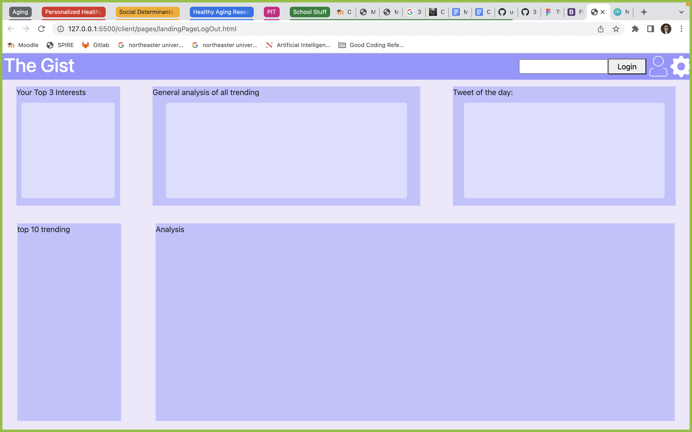
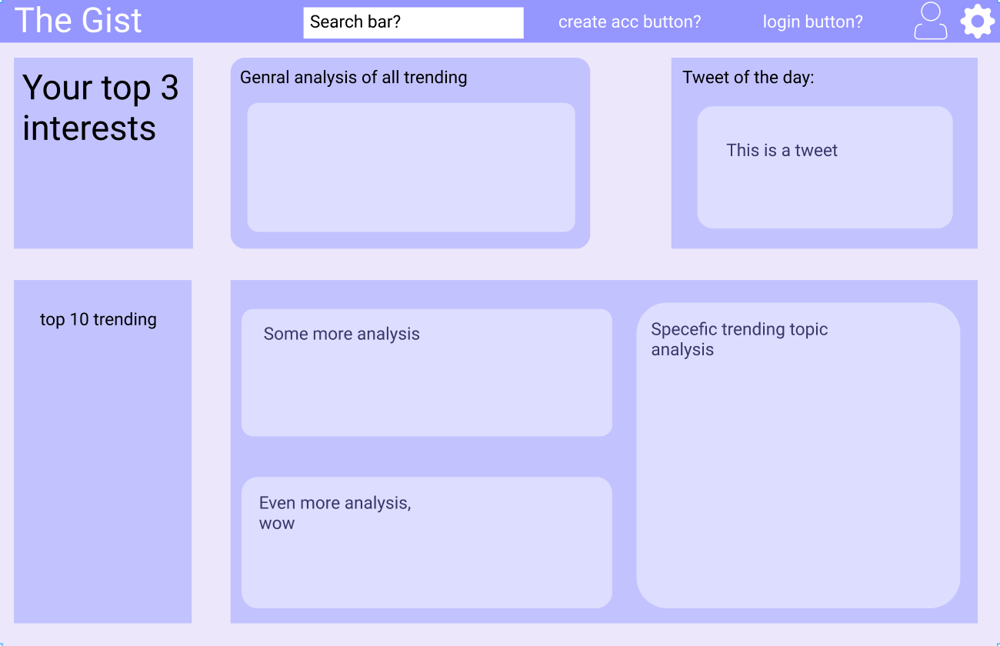

## Important Components:

 - Main page for all users to see:
    - Top n trending topics on twitter with visually pleasing analysis and top n tweets
 - Topic page hubs for user specific interests
    - topic specific trends similar to main page

We will be using the Twitter API to get these tweets along with various sentiment and lexicon analysis tools for our data processing. We will populate and query a realtime database to keep the applications content updated each day. 

Users will be able to log in and access a profile where they can select interests/topics that they would like to see analysis of. 

Features:
 - analysis of user specific interests over user specified time span with visual data.
 - Search option

## Landing page wireframe:

## Landing page wireframe (Figma):

## Divison of labor:
- Met in a group to create the Figma wireframe with each person making equal contributions
- Collaberatively wrote html and css over Zoom with one person coding and the others providing input
- Worked together to write this document

